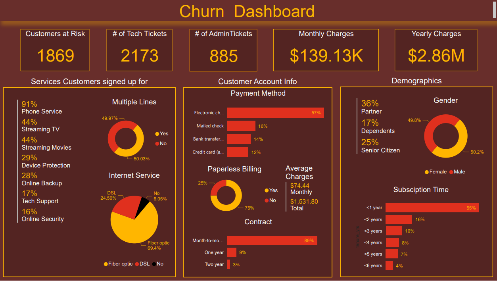

# Customer-Churn-Analysis

Customer demographics and insights.

Created a dashboard in Power BI for Janet (Retention Manager) that reflects all relevant Key Performance Indicators (KPIs) and metrics in the dataset. KPIs include

Customers who left within the last month
Services each customer has signed up for: phone, multiple lines, internet, online security, online backup, device protection, tech support, and streaming TV and movies
Customer account information: how long as a customer, contract, payment method, paperless billing, monthly charges, total charges and number of tickets opened in the categories administrative and technical
Demographic info about customers – gender, age range, and if they have partners and dependents

)
